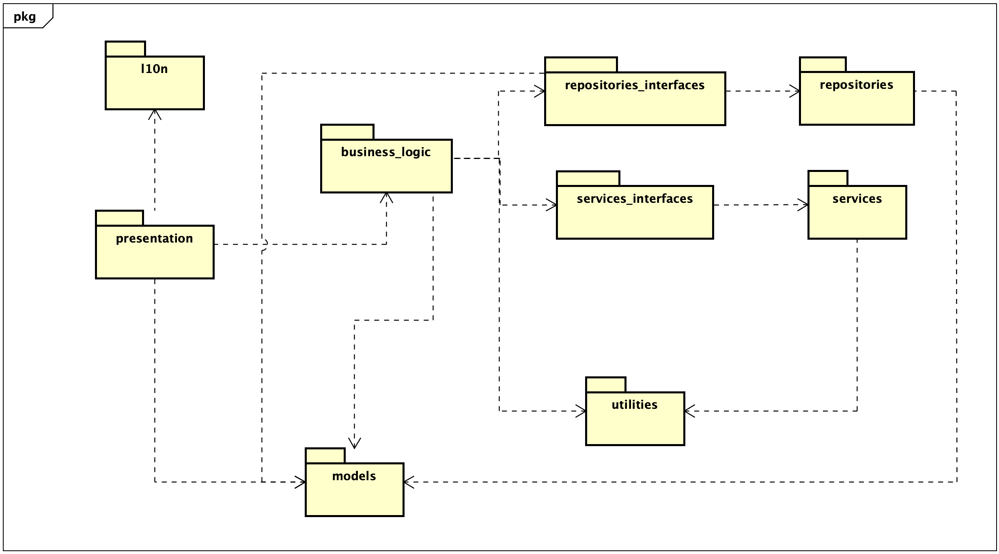

# Coffee App

A Flutter application for coffee enthusiasts to explore and enjoy various coffee-related features.

## Table of Contents

- [About](#about)
- [Architecture](#architecture)
- [Usage of Bloc](#usage-of-bloc)
- [Installation](#installation)
- [Localization](#localization)
- [Testing with Mocks](#testing-with-mocks)
- [Future Improvements](#future-improvements)
- [Contact](#contact)

## About

This project is built using Flutter version 3.22.1. Below are the details of the development environment:

```cmd
Flutter 3.22.1 • channel stable • https://github.com/flutter/flutter.git
Framework • revision a14f74ff3a (5 weeks ago) • 2024-05-22 11:08:21 -0500
Engine • revision 55eae6864b
Tools • Dart 3.4.1 • DevTools 2.34.3
```

## Architecture



The project follows a well-structured architecture to maintain separation of concerns and scalability. Below is an explanation of each component:

- **L10n**: Handles localization. This folder contains all text-related files, facilitating easy updates for new languages.
- **Presentation**: Contains screens, widgets, app bars, bottom bars, etc. Everything the user interacts with.
- **Business Logic**: Manages the communication between the presentation layer and external services (repositories and services). Uses Bloc (specifically Cubit) to manage state and logic.
- **Repositories Interfaces**: Define contracts for data fetching and saving.
- **Services Interfaces**: Define contracts for external service communications, typically involving API calls.
- **Repositories**: Implement repository interfaces.
- **Services**: Implement service interfaces.
- **Utilities**: Include configuration files and enums used across the app, ensuring centralized management.
- **Models**: Core classes that define the application's data structures and problem domain.

### SOLID Principles

The business logic adheres to SOLID principles, ensuring that the codebase is maintainable, scalable, and testable. Each component has a single responsibility, dependencies are injected, and interfaces are used to abstract and decouple different parts of the app.

## Usage of Bloc

The presentation layer listens for changes in the business logic using BlocBuilder. BlocBuilder rebuilds parts of the UI when the business logic emits updates. This approach efficiently separates UI from business logic, ensuring a responsive and maintainable application.

```dart
BlocBuilder<YourCubit, YourState>(
  builder: (context, state) {
    if (state is YourSpecificState) {
      return YourWidget();
    }
    return Container();
  },
);
```

## Installation

To run the app, follow these steps:

1. **Install Flutter**: Ensure you have Flutter installed on your machine.
2. **Fetch dependencies**: Run the following commands:

    ```bash
    flutter clean && flutter pub get
    ```

   For iOS:

    ```bash
    cd ios
    flutter clean && flutter pub get && pod install
    cd ..
    ```

3. **Run the app**:

    ```bash
    flutter run
    ```

## Localization

To add a new word to the localization, update the `.arb` file and run:

```bash
flutter pub run intl_utils:generate
```

Access localization in the presentation layer:

```dart
import 'package:coffee_app/localization.dart';
```

## Testing with Mocks

The app uses mocks to fully test Cubits. If you add or modify an abstract interface, run:

```bash
flutter pub run intl_utils:generate
```

## Future Improvements

- **Image Preloading**: Implement background preloading of images to reduce user wait times.
- **Pagination**: Add pagination for favorite photos to handle large data sets efficiently.
- **Logging**: Integrate comprehensive logging throughout the app for better monitoring and debugging.

## Contact

If you have any questions or suggestions, feel free to reach out:

- Email: [ignaciovallarinocibils@gmail.com](mailto:ignaciovallarinocibils@gmail.com)
